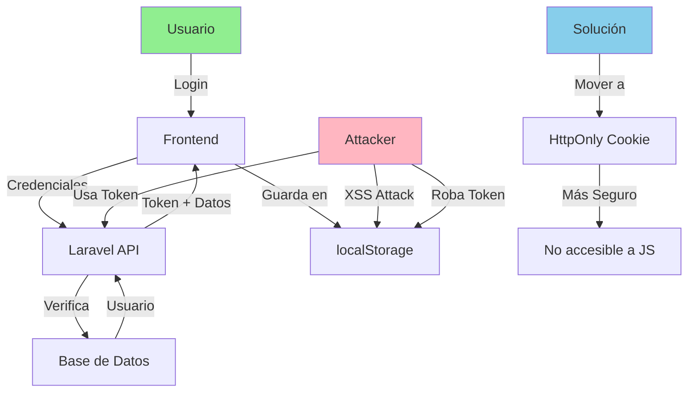

# Informe de Análisis de Código - SkillBay

## Resumen Ejecutivo

Este informe presenta un análisis exhaustivo del código del proyecto SkillBay, una aplicación full-stack que incluye un backend Laravel (PHP) y un frontend React. Se identificaron múltiples áreas de mejora relacionadas con seguridad, rendimiento, mantenibilidad y buenas prácticas de programación.

---

## 1. Estructura General del Proyecto

### 1.1 Arquitectura

El proyecto sigue una arquitectura MVC estándar con Laravel como API REST y React como cliente. La estructura es organizada pero presenta inconsistencias en la nomenclatura y patrones de implementación.

### 1.2 Evaluación de Principios SOLID, DRY y KISS

| Principio | Estado | Observaciones |
|-----------|--------|---------------|
| **SRP** | ⚠️ Parcial | Controladores con múltiples responsabilidades (ej: `UsuarioController` maneja auth, perfil, imágenes, admin) |
| **OCP** | ✅ Cumple | Uso de middlewares para extensión |
| **LSP** | ✅ Cumple | Relaciones Eloquent bien definidas |
| **ISP** | ✅ Cumple | Interfaces claras en servicios |
| **DIP** | ✅ Cumple | Inyección de dependencias en controladores |
| **DRY** | ❌ Incumple | Duplicación de lógica de notificaciones, validaciones repetidas |
| **KISS** | ⚠️ Parcial | Algunos métodos son excesivamente largos |

---

## 2. Hallazgos por Componente

### 2.1 Backend - Controladores API

#### Problemas Críticos

1. **Exposición de errores en producción** (`UsuarioController.php:119`)
   ```php
   catch (\Exception $e) {
       return response()->json([
           'success' => false,
           'message' => 'Error interno del servidor',
           'error' => $e->getMessage(), // ⚠️ Expone stack trace
       ], 500);
   }
   ```
   - **Impacto**: Revela información sensible del servidor
   - **Solución**: Usar `$e->getMessage()` solo en desarrollo, loguear el error real

2. **Validación duplicada** (`UsuarioController.php:64-65`)
   ```php
   'password.regex' => 'La contraseña no puede contener espacios.',
   'password.regex' => 'La contraseña debe contener...', // Sobrescribe el anterior
   ```
   - **Impacto**: El primer mensaje de error nunca se mostrará
   - **Solución**: Eliminar duplicados y unificar mensajes

3. **Sin paginación** (`UsuarioController.php:357`, `PostulacionController.php:401`)
   ```php
   $usuarios = Usuario::orderBy('created_at', 'desc')->get(); // ⚠️ Carga todos los registros
   ```
   - **Impacto**: Problemas de memoria con grandes volúmenes de datos
   - **Solución**: Usar `->paginate(15)` o `->cursorPaginate()`

4. **Rutas duplicadas** (`api.php:51-57`)
   ```php
   Route::get('/servicios/solicitudes', ...);
   Route::apiResource('servicios', ...);
   Route::get('/servicios/solicitudes', ...); // Duplicada
   ```

5. **Falta de paginación en notificaciones** (`NotificacionController.php:59`)
   ```php
   $notificaciones = $query->limit(150)->get() // Límite hardcoded
   ```
   - **Problema**: `limit()` sin paginación real dificulta la navegación

6. **Verificación de dominio de email vulnerable a timeouts** (`AuthRecoveryController.php:31-37`)
   ```php
   if (!$domain || !checkdnsrr($domain, 'MX')) { // ⚠️ Puede bloquear el servidor
   ```
   - **Impacto**: DNS lookups pueden ser lentos o fallar, causando timeouts

#### Problemas Medios

7. **N+1 Query** (`ResenaController.php:93-98`)
   ```php
   $resenas = Reseña::whereHas('servicio', ...)
       ->with(['servicio:id_Servicio,titulo']) // ⚠️ Carga relación que ya se verificó en whereHas
   ```

8. **Validación inconsistente de estados** (`PostulacionController.php:71`)
   ```php
   'estado' => 'required|in:pendiente,aceptada,rechazada,en_progreso',
   ```
   - **Problema**: No incluye todos los estados (`completada`, `pagada`, `cancelada`)

9. **Inconsistencia en nombres de métodos** (`UsuarioController.php:346, 478`)
   ```php
   public function listarAdmin(...) // different naming
   public function listar()         // than this one
   ```

10. **Ausencia de transacciones** (`PostulacionController.php:264-288`)
    ```php
    // Crear postulación + cambiar rol + crear notificación como operaciones separadas
    // Si una falla, las otras quedan en estado inconsistente
    ```

### 2.2 Backend - Modelos

11. **Relación duplicada** (`Servicio.php:28-36`)
    ```php
    public function cliente() { return $this->belongsTo(...); }
    public function cliente_usuario() { return $this->belongsTo(...); } // Duplicada
    ```

12. **Modelo sin timestamps** (`Usuario.php:18`)
    ```php
    public $timestamps = false; // ⚠️ Dificulta auditoría
    ```
    - **Recomendación**: Habilitar timestamps o implementar lógica de auditoría manual

13. **Sin casts para campos importantes** (`Postulacion.php`)
    ```php
    // Faltan casts para: fecha, estado, presupuesto
    ```

### 2.3 Backend - Seguridad

14. **Sanitización excesiva e incorrecta** (`Login.jsx:17-29`)
    ```javascript
    const sanitize = (name, value) => {
        s = s.replace(/['"`;=<>\/\*]/g, ''); // ⚠️ Elimina caracteres válidos
    }
    ```
    - **Impacto**: Puede romper funcionalidades (ej: passwords con *)
    - **Realmente**: Laravel ya sanitiza, esto es redundante y peligroso

15. **Token en localStorage** (múltiples archivos)
    ```javascript
    localStorage.setItem("access_token", data.access_token); // ⚠️ Vulnerable a XSS
    ```
    - **Recomendación**: Usar HttpOnly cookies para tokens

16. **Falta rate limiting** - No se observa implementación de protección contra brute force

17. **Validación de webhook incompleta** (`MercadoPagoController.php:176`)
    ```php
    if (!$this->verificarFirmaWebhook($request)) { // Método no encontrado en el código
    ```

### 2.4 Frontend - React

18. **useEffect sin cleanup** (`UserProfile.jsx:53-55`)
    ```javascript
    useEffect(() => {
        fetchProfile();
    }, []); // ⚠️ Sin abort controller para fetch
    ```

19. **Sin manejo de errores de red** (`NotificationCenter.jsx:40-43`)
    ```javascript
    } catch (error) {
        console.error("Error notifications:", error); // ⚠️ Solo loggea
    }
    ```

20. **Variables no usadas** (`Login.jsx:9`)
    ```javascript
    const [showPassword, setShowPassword] = useState(false); // Se usa, OK
    ```

21. **Inconsistencia en manejo de estado de carga** (`Applications.jsx`)
    - Mezcla de `setLoading` manual con try/finally

22. **No hay loading states para todas las operaciones** - Algunas acciones no muestran feedback al usuario

23. **Memory leak potencial** (`App.jsx:69-71`)
    ```javascript
    useEffect(() => {
        localStorage.setItem("currentView", currentView); // ⚠️ Se ejecuta en cada render
    }, [currentView]);
    ```
    - **Impacto**: Escritura innecesaria a localStorage en cada cambio

---

## 3. Consultas a Base de Datos

### 3.1 Problemas Identificados

| Problema | Ubicación | Impacto |
|----------|-----------|---------|
| Sin paginación | `listarAdmin`, `notificaciones` | Alto |
| N+1 queries | `perfilPublico`, `resenas` | Medio |
| Sin índices | Foreign keys en migraciones | Medio |
| Queries en loops | `notificarATodos` | Alto |
| Límite hardcoded | `NotificacionController` | Bajo |

### 3.2 Falta de Índices

Las migraciones no definen índices explícitos para claves foráneas:
- `postulaciones.id_Servicio`
- `postulaciones.id_Usuario`
- `notificaciones.id_CorreoUsuario`
- `reseñas.id_Servicio`

### 3.3 Ejemplo de Query Ineficiente

```php
// NotificacionController.php:214-222
$usuarios = Usuario::select('id_CorreoUsuario')->get();
foreach ($usuarios as $usuario) {  // ⚠️ N queries
    Notificacion::create([...]);
}
```

**Solución**:
```php
$usuarios = Usuario::select('id_CorreoUsuario')->pluck('id_CorreoUsuario');
$notificaciones = $usuarios->map(fn($email) => [...])->toArray();
Notificacion::insert($notificaciones);
```

---

## 4. Gestión de APIs Externas

### 4.1 MercadoPago

**Positivos**:
- Verificación de estado con API de MP antes de aprobar
- Uso de external_reference para trazabilidad
- Manejo de múltiples estados (approved, pending, rejected)

**Problemas**:
1. Webhook no verifica firma correctamente
2. `notification_url` comentada (línea 86) - sin notificaciones en tiempo real
3. Sin reintentos automáticos en caso de fallo
4. Logs excesivos que pueden exponer datos sensibles

### 4.2 Recomendaciones para APIs

1. Implementar circuit breaker pattern
2. Usar colas (queues) para procesar webhooks
3. Configurar reintentos exponenciales
4. Mascarar datos sensibles en logs

---

## 5. Manejo de Errores y Excepciones

### 5.1 Evaluación

| Aspecto | Estado | Notas |
|---------|--------|-------|
| Consistencia de respuestas | ⚠️ Mixto | Algunos usan `success`, otros no |
| Códigos HTTP | ✅ Correcto | Uso apropiado de 200, 201, 401, 403, 404, 422 |
| Logging | ⚠️ Excesivo | Algunos métodos loguean demasiado |
| Error boundaries (FE) | ❌ Falta | No hay en React |
| User-friendly messages | ⚠️ Mixto | Algunos exponen errores técnicos |

### 5.2 Ejemplo de Mejora

```php
// Antes (expone detalles)
catch (\Exception $e) {
    return response()->json(['error' => $e->getMessage()], 500);
}

// Después (mejor)
catch (\Exception $e) {
    Log::error($e); // Solo en logs
    return response()->json([
        'success' => false,
        'message' => 'Error interno. Contacte soporte.',
        'error_id' => Str::uuid() // Para referencia
    ], 500);
}
```

---

## 6. Nomenclatura y Convenciones

### 6.1 Inconsistencias Encontradas

| Área | Inconsistencia |
|------|----------------|
| Nombres de métodos | `listarAdmin` vs `listar` vs `index` |
| Nombres de archivos | Mixto: `UsuarioController` vs `userProfile.jsx` |
| Estados | `No leido` vs `No_leido` vs `no_leido` |
| Variables | `id_CorreoUsuario` vs `email` en frontend |
| Comments | Español/Inglés mezclado |

### 6.2 Recomendaciones

1. Estandarizar a camelCase para JS y snake_case para PHP
2. Usar inglés para todos los comentarios y mensajes
3. Implementar un linter (ESLint para JS, PHP-CS-Fixer para PHP)

---

## 7. Gestión de Recursos y Memoria

### 7.1 Problemas

1. **Carga de imágenes sin optimización** (`UserProfile.jsx`)
   - No hay redimensionamiento en servidor
   - Carga imágenes originales de hasta 2MB

2. **Sin streaming** - Respuestas JSON completas en memoria

3. **Sin cacheo** - No se observa uso de cache para consultas frecuentes

### 7.2 Recomendaciones

1. Implementar intervención de imágenes (Laravel)
2. Usar recursos API con paginación
3. Implementar Redis para cacheo de consultas frecuentes

---

## 8. Recomendaciones Priorizadas

### PRIORIDAD CRÍTICA (Corregir Inmediatamente)

| # | Recomendación | Ubicación | Esfuerzo |
|---|---------------|-----------|----------|
| 1 | Eliminar exposición de stack traces | Todos los controladores | Bajo |
| 2 | Implementar paginación | `listarAdmin`, `notificaciones` | Medio |
| 3 | Mover token a HttpOnly cookies | Frontend completo | Alto |
| 4 | Corregir validación duplicada | `UsuarioController` | Bajo |
| 5 | Implementar transacciones | `PostulacionController` | Medio |

### PRIORIDAD ALTA (Corregir Esta Semana)

| # | Recomendación | Ubicación | Esfuerzo |
|---|---------------|-----------|----------|
| 6 | Eliminar relación duplicada | `Servicio.php` | Bajo |
| 7 | Agregar índices de BD | Migraciones | Medio |
| 8 | Corregir sanitize en Login | `Login.jsx` | Bajo |
| 9 | Unificar formato de estados | Todo el sistema | Medio |
| 10 | Implementar error boundaries | React | Medio |

### PRIORIDAD MEDIA (Corregir Este Mes)

| # | Recomendación | Ubicación | Esfuerzo |
|---|---------------|-----------|----------|
| 11 | Extraer lógica de notificaciones a trait/service | Controladores | Alto |
| 12 | Implementar rate limiting | Rutas auth | Bajo |
| 13 | Optimizar N+1 queries | Varios controladores | Medio |
| 14 | Agregar tests unitarios | Backend | Alto |
| 15 | Implementar cacheo con Redis | Consultas frecuentes | Medio |

### PRIORIDAD BAJA (Mejoras a Largo Plazo)

| # | Recomendación | Esfuerzo |
|---|---------------|-----------|
| 16 | Refactorizar controladores grandes | Alto |
| 17 | Migrar a TypeScript | Alto |
| 18 | Implementar GraphQL | Alto |
| 19 | Agregar documentación OpenAPI | Medio |
| 20 | Implementar monitoring (Sentry) | Medio |

---

## 9. Diagrama de Flujo - Problema de Seguridad Principal



---

## 10. Conclusión

El proyecto SkillBay presenta una base sólida con una arquitectura clara, pero requiere mejoras significativas en:

1. **Seguridad**: Exposición de errores, manejo de tokens, validación
2. **Rendimiento**: Paginación, índices de BD, optimización de queries
3. **Mantenibilidad**: Código duplicado, inconsistencias de nomenclatura
4. **Confiabilidad**: Manejo de errores, transacciones, tests

Las recomendaciones priorizadas permiten abordar los problemas más críticos primero, mejorando la estabilidad y seguridad del sistema antes de invertir en optimizaciones de menor prioridad.

---

*Informe generado el 2026-03-04*
*Proyecto: SkillBay*
*Stack: Laravel 10 + React 18*
